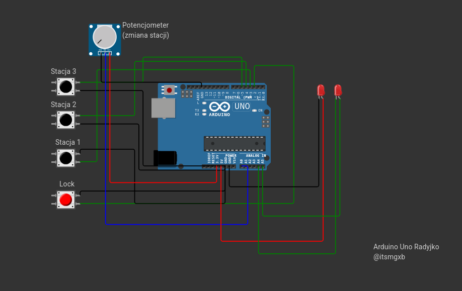

# 📻 Radio FM z TEA5767 i ESP8266 / Arduino

Prosty projekt radia FM z możliwością strojenia częstotliwości potencjometrem oraz wyborem ulubionych stacji za pomocą przycisków. Wbudowana funkcja blokady częstotliwości zabezpiecza przed przypadkowym jej przestawieniem.

---

## 🔧 Funkcje

- Strojenie częstotliwości za pomocą potencjometru
- Blokowanie zmiany częstotliwości jednym przyciskiem
- Trzy konfigurowalne przyciski ulubionych stacji
- Konfigurowalny układ pinów
- Gotowe pod rozbudowę o ekran LCD i diody LED

---

## 🧰 Wymagane elementy

- Mikrokontroler: **ESP8266 (NodeMCU)** lub **Arduino Uno**
- Moduł radia FM **TEA5767**
- Potencjometr (10kΩ)
- 4 przyciski (3 do stacji + 1 do blokady)
- (opcjonalnie) dioda LED
- Przewody połączeniowe
- Płytka stykowa

---

## ⚙️ Połączenia

### 🟦 ESP8266 (NodeMCU)

#### 📻 TEA5767 → ESP8266 (I2C)

| TEA5767 Pin | ESP8266 Pin |
|-------------|-------------|
| VCC         | 3.3V        |
| GND         | GND         |
| SDA         | D2 (GPIO4)  |
| SCL         | D1 (GPIO5)  |

#### 🎛️ Potencjometr

| Potencjometr Pin | ESP8266 Pin |
|------------------|-------------|
| Środkowy         | A0          |
| Jeden bok        | 3.3V        |
| Drugi bok        | GND         |

#### 🔘 Przyciski

Każdy przycisk:
- jeden pin do GND,
- drugi do GPIO (z `INPUT_PULLUP`).

| Funkcja             | ESP8266 GPIO | NodeMCU Pin |
|---------------------|--------------|-------------|
| Blokada częstotliwości | GPIO14     | D5          |
| Stacja 1 (np. 98.8 FM) | GPIO12     | D6          |
| Stacja 2 (np. 105.6 FM)| GPIO13     | D7          |
| Stacja 3 (np. 91.0 FM) | GPIO15     | D8          |

---

### 🔴 Arduino Uno

#### 📻 TEA5767 → Arduino Uno (I2C)

| TEA5767 Pin | Arduino Uno Pin  |
|-------------|------------------|
| VCC         | 5V               |
| GND         | GND              |
| SDA         | A4               |
| SCL         | A5               |

#### 🎛️ Potencjometr

| Potencjometr Pin | Arduino Uno Pin  |
|------------------|------------------|
| Środkowy         | A0               |
| Jeden bok        | 5V               |
| Drugi bok        | GND              |

#### 🔘 Przyciski

Każdy przycisk:
- jeden pin do GND,
- drugi do cyfrowego pinu (z `INPUT_PULLUP`).

| Funkcja                | Arduino Pin |
|------------------------|-------------|
| Blokada częstotliwości | 2           |
| Stacja 1 (np. 98.8 FM) | 3           |
| Stacja 2 (np. 105.6 FM)| 4           |
| Stacja 3 (np. 91.0 FM) | 5           |

---

## 💾 Kod

Kod znajduje się w pliku `.ino`. Na górze pliku znajduje się sekcja konfiguracyjna, gdzie można:

- ustawić częstotliwości ulubionych stacji,
- zdefiniować piny dla przycisków i potencjometru,
- włączyć lub wyłączyć obsługę LCD i LED (w przyszłości).

---

## 📦 Wymagane biblioteki

- `Wire.h`
- (opcjonalnie) `LiquidCrystal_I2C.h`

---

## 🚀 Przyszłe rozszerzenia

- Wyświetlanie częstotliwości na LCD
- Dodanie wskaźnika LED dla stanu "blokady"
- Automatyczne skanowanie dostępnych stacji

---

## 📝 Licencja

Projekt open-source. Możesz używać, modyfikować i udostępniać zgodnie z własnymi potrzebami.

---

> Stworzono jako hobbystyczny projekt edukacyjny.  
> Jeśli zbudowałeś własne radio na bazie tego projektu — podziel się linkiem!
